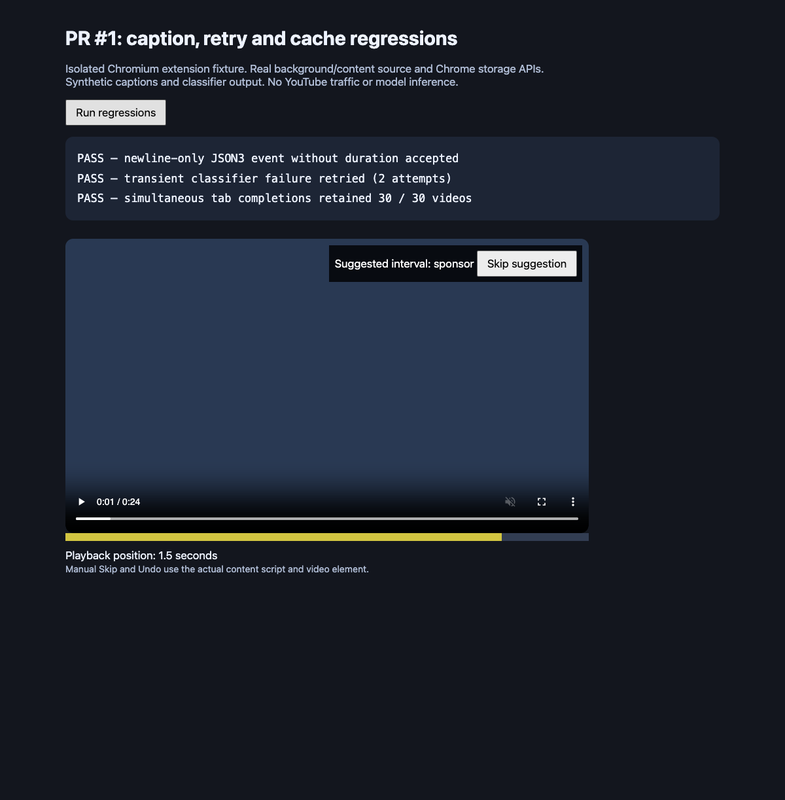
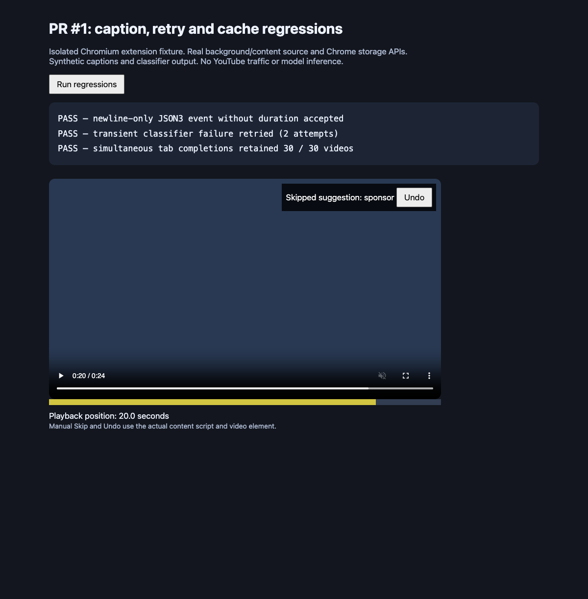
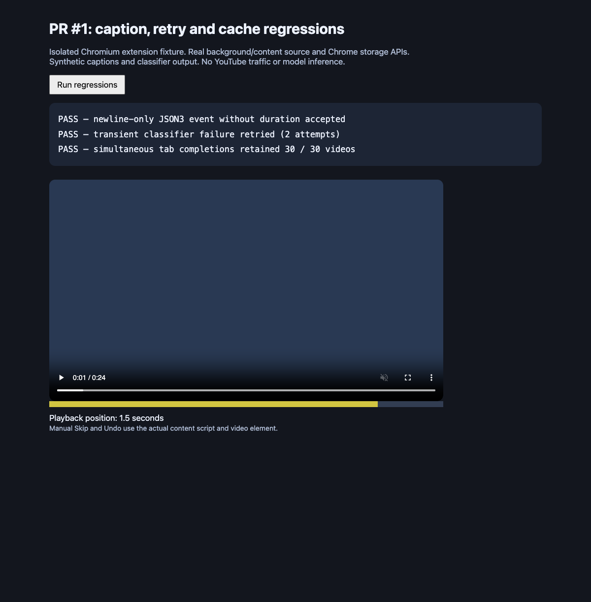

# PR #1 regression evidence

Captured on 7 October 2026 with Chromium 148.0.7778.97 and Node 24.15.0.

The isolated MV3 fixture copies the actual background/content source and uses real Chrome storage, tabs and messages. Its classifier and caption retrieval are synthetic. It exercises the caption handler directly rather than requesting YouTube captions. No model weights are included.

- A newline-only JSON3 separator without duration was accepted.
- The same caption URL succeeded on its second attempt after one classifier failure.
- Two tabs completed together and retained exactly 30 cache entries.
- Manual Skip sought from 1.5 to 20 seconds. Undo returned to 1.5 seconds without another suggestion.

## Reproduce

Run from the repository root. The media fixture requires FFmpeg; browser automation uses `agent-browser`.

```sh
node tests/browser-fixture.mjs artifacts/review-browser
ffmpeg -hide_banner -loglevel error -f lavfi \
  -i 'color=c=0x263a54:s=800x450:r=10:d=24' \
  -an -c:v libx264 -pix_fmt yuv420p -y artifacts/review-browser/fixture.mp4
node artifacts/review-browser/serve.mjs
```

In another terminal:

```sh
agent-browser --session sponsor-pr1 --extension "$PWD/artifacts/review-browser" \
  open 'http://127.0.0.1:8765/watch?v=first'
agent-browser --session sponsor-pr1 click '#run'
agent-browser --session sponsor-pr1 wait --fn 'window.reviewResult?.ok === true'
agent-browser --session sponsor-pr1 eval 'document.querySelector("video").pause()'
agent-browser --session sponsor-pr1 click '#sponsor-skip-suggestion button'
agent-browser --session sponsor-pr1 eval 'document.querySelector("video").currentTime'
agent-browser --session sponsor-pr1 click '#sponsor-undo-notice button'
agent-browser --session sponsor-pr1 eval 'document.querySelector("video").currentTime'
agent-browser --session sponsor-pr1 close
```

Use a fresh browser session for each run. This evidence does not cover production-bundle inference, live YouTube, worker suspension, held-out accuracy or redistribution rights.

## Manual suggestion



## Skip with Undo



## Restored playback


